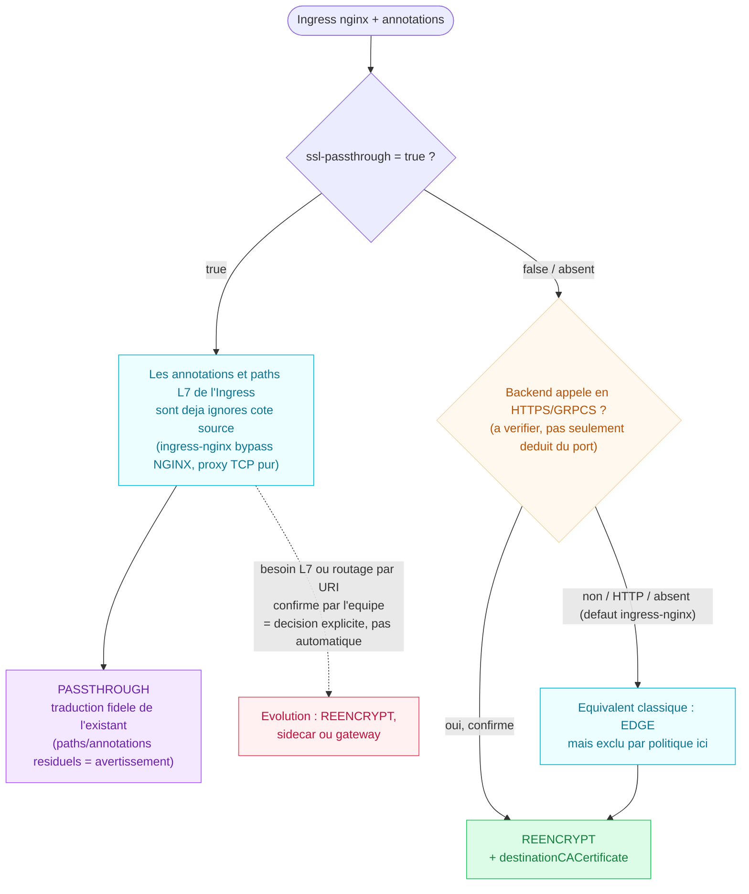

# Migration Ingress nginx (IKS) → Route OpenShift (ROKS)

> Référentiel de migration : arbre d'orientation de la terminaison TLS + tableau de correspondance des annotations `nginx.ingress.kubernetes.io/*` vers les Routes OpenShift.
> Pour chaque annotation sans équivalent natif sur la Route, une solution est proposée.
>
> **Convention** : « Route OpenShift » à la première mention, « Route » ensuite.
> Schémas associés (mêmes contenus, éditables) : `arbre-decision-tls-route.drawio`, `arbre-decision-tls-route.svg`.

---

## 1. Contexte & principes

**Objectif** : traduire fidèlement chaque Ingress IKS en Route ROKS équivalente, selon le **besoin réel de l'application**. Ce document ne recommande pas un mode de terminaison a priori — il fournit la correspondance et laisse le besoin exprimé par l'Ingress décider.

- **Le mode de terminaison découle du besoin, pas d'un choix par défaut** :
  - `passthrough` = **mode privilégié dans cette architecture cible** lorsque l'application termine elle-même le TLS et qu'aucune fonction L7 n'est requise au niveau du routeur. *(Ne pas confondre avec ingress-nginx : le passthrough y est désactivé par défaut et nécessite une activation explicite du contrôleur — ce n'est pas le comportement général d'un Ingress standard.)*
  - `reencrypt` : lorsque le routeur doit voir le trafic HTTP (fonctions L7) **et** que le backend sert du TLS.
  - `edge` : **exclu** par politique (chiffrement pod-to-pod obligatoire → pas de trafic en clair vers le pod).
- **Limite structurelle du multi-path.** Une Route `passthrough` sélectionne le backend uniquement à partir du SNI/hostname et ne voit pas l'URI HTTP : elle ne peut pas implémenter un routage actif par path. Mais la même règle que pour les autres annotations L7 s'applique : quand l'Ingress source utilise déjà `ssl-passthrough=true`, les paths ne sont pas appliqués par ingress-nginx (le contrôleur contourne NGINX et fait du proxy TCP pur) — leur seule présence ne doit donc pas exclure automatiquement une Route `passthrough`. Une évolution vers `reencrypt` n'est requise que si un routage réel par URI est confirmé par l'équipe applicative. Quand `ssl-passthrough` est absent/`false`, en revanche, plusieurs paths actifs constituent un besoin L7 réel et excluent bien le `passthrough`.
- **Sidecar nginx = une option parmi d'autres pour les fonctions L7 non exprimables sur une Route** (regex, CORS, snippets, buffering, tailles de body) — pas la seule. Selon le contexte, la fonction peut aussi être mieux placée dans l'application elle-même, une API gateway, un service mesh, ou une configuration globale d'IngressController. Le sidecar est mobilisé **au besoin**, pas systématiquement. La Route ne porte que ce qui est exprimable en annotation `haproxy.router.openshift.io/*` / `router.openshift.io/*` ou en champ `spec.*`.
- **Limites structurelles d'une Route** :
  - matching de path en **préfixe uniquement** (pas de regex) ;
  - **aucune injection** de configuration HAProxy arbitraire par Route (pas d'équivalent `configuration-snippet`) ;
  - en `passthrough`, **le routeur ne déchiffre pas le trafic et ne voit que le SNI TLS** → ni cookie, ni multipath, ni manipulation HTTP.

---

## 2. Arbre de traduction — quelle terminaison pour la Route ? (version simplifiée)

Le mode de terminaison de la Route se **déduit** de ce que déclare l'Ingress, en distinguant deux dimensions : la déclaration `ssl-passthrough`, et — quand elle est absente — le protocole réellement utilisé vers le backend.

**`ssl-passthrough=true` se traduit toujours en `passthrough`**, pour reproduire fidèlement le comportement actuel. D'après la documentation officielle ingress-nginx, le passthrough opère en couche 4 (TCP) et invalide **déjà, côté source**, toutes les autres annotations de l'Ingress (cookie, rewrite, CORS, snippet…) : leur présence ne signifie donc pas qu'elles sont fonctionnelles aujourd'hui. Si l'équipe applicative confirme un besoin L7 réellement attendu, la bascule vers `reencrypt` (ou un sidecar/gateway) est une **décision explicite à arbitrer avec elle** — pas un effet automatique de la traduction.

Quand `ssl-passthrough` est absent ou à `false`, le routeur termine le TLS (L7 disponible). Le protocole du backend détermine alors la suite : backend HTTPS/GRPCS → `reencrypt` directement ; backend HTTP → l'équivalent classique serait `edge`, mais ce mode est exclu ici par politique, donc il faut d'abord rendre le backend accessible en HTTPS (ex. sidecar) puis passer en `reencrypt`. **Le protocole par défaut d'ingress-nginx est HTTP** : en l'absence de `backend-protocol`, ne pas présumer HTTPS. Le nom ou le numéro du port du Service (`https`, `443`, `8443`) peut servir d'**indice d'inventaire**, mais pas de preuve — un port nommé `https` peut très bien exposer du HTTP en réalité, et inversement. À confirmer par l'analyse de l'application, du Service, et si besoin par un test réseau.



> **EDGE non applicable en cible** : chiffrement pod-to-pod obligatoire (choix de politique, pas un oubli). Un Ingress dont l'équivalent classique serait `edge` (TLS terminé côté client, backend en clair) doit d'abord recevoir du TLS côté backend (sidecar) avant de devenir une Route `reencrypt`.
>
> **Multi-path** : avec `ssl-passthrough=false`/absent, plusieurs paths actifs sur un même host constituent un besoin L7 réel et excluent le `passthrough`. Avec `ssl-passthrough=true`, ces paths sont déjà non fonctionnels côté ingress-nginx (proxy TCP pur) — leur présence déclenche un **avertissement à valider avec l'équipe applicative**, pas une exclusion automatique du `passthrough`.

**Résumé décisionnel**

| Situation | Verdict |
|---|---|
| `ssl-passthrough = true`, y compris avec paths/annotations L7 résiduels | **PASSTHROUGH** (traduction fidèle ; vérifier si ces éléments étaient réellement attendus) |
| `ssl-passthrough = true` + besoin L7 ou multi-path **confirmé** par l'équipe | Évolution explicite vers **REENCRYPT**, sidecar ou gateway |
| `ssl-passthrough = false` / absent + backend HTTPS/GRPCS confirmé | **REENCRYPT** |
| `ssl-passthrough = false` / absent + backend HTTP (défaut ingress-nginx) | Équivalent classique **EDGE**, exclu ici → TLS à ajouter côté backend puis **REENCRYPT** |
| `ssl-passthrough = false` / absent + multi-path | **REENCRYPT**, ou routage L7 reporté derrière la terminaison TLS |

---

## 3. Tableau de correspondance des annotations

Colonne **Cible** : `ANN` = annotation de Route · `SPEC` = champ `spec.*` de la Route · `IC` = configuration `IngressController` (global) · `SIDECAR` = à porter dans la conf du sidecar nginx · ❌ = pas d'équivalent natif Route.
Colonne **Équivalent Route** : `—` quand il n'existe pas d'équivalent (voir alors la colonne **Solution**).
Colonne **Passthrough ?** : capacité du **routeur seul** en `passthrough` (pas de vue HTTP). ✅ compatible tel quel · ❌ nécessite que le routeur voie le trafic HTTP (ne fonctionne pas en passthrough — la fonction, si réellement requise, se reporte côté app/sidecar) · N/A sans objet (géré hors routeur, indépendant de la terminaison) · **Choix** = l'annotation détermine elle-même le mode de terminaison.
Les lignes marquées *(doc)* sont confirmées par les tables 2 & 3 de la page Confluence existante.

### 3.1 TLS & redirection

| Annotation nginx | Cible | Équivalent Route | Solution | Passthrough ? |
|---|---|---|---|---|
| `nginx.ingress.kubernetes.io/ssl-passthrough` | SPEC | `spec.tls.termination: passthrough` | Se traduit toujours en `passthrough` (traduction fidèle, cf. arbre section 2). Bascule vers `reencrypt` uniquement sur décision explicite si un besoin L7 réel est confirmé — pas automatique. | Choix |
| `nginx.ingress.kubernetes.io/ssl-redirect` | SPEC | `spec.tls.insecureEdgeTerminationPolicy: Redirect` | À configurer explicitement pour forcer HTTPS. Le défaut n'est pas garanti à `Redirect` (souvent `None` selon la plateforme / le mode de création de la Route). La politique `Redirect` peut être appliquée sur une Route `passthrough` (le routeur redirige sans déchiffrer). Vérifier séparément le comportement du port HTTP côté source, notamment quand `ssl-passthrough=true` : le flux TLS passthrough contourne NGINX, tandis que la requête HTTP suit un chemin distinct. | ✅ |
| `nginx.ingress.kubernetes.io/force-ssl-redirect` | SPEC | `spec.tls.insecureEdgeTerminationPolicy: Redirect` | Idem `ssl-redirect`. | ✅ |
| `ingress.kubernetes.io/force-ssl-redirect` | SPEC | `spec.tls.insecureEdgeTerminationPolicy: Redirect` | Ancienne clé, même mapping. | ✅ |
| `nginx.ingress.kubernetes.io/backend-protocol` | SPEC | — | **Signal d'entrée**, pas une conséquence : il indique le protocole déjà utilisé par nginx vers le backend, et sert à décider la terminaison (cf. arbre section 2). `HTTP`/absent → équivalent edge (exclu ici → sidecar + reencrypt) ; `HTTPS` → reencrypt direct ; `GRPC` → analyser HTTP/2 ou h2c ; `GRPCS` → reencrypt ou passthrough selon besoin L7. Avec `ssl-passthrough=true`, cette annotation est également invalidée côté source. | N/A |
| `nginx.ingress.kubernetes.io/ssl-protocols` | IC / SIDECAR | — | Versions/ciphers via `IngressController.spec.tlsSecurityProfile` (global) ; par app → `ssl_protocols` du sidecar. | N/A |
| `nginx.ingress.kubernetes.io/proxy-ssl-verify` | SPEC | `spec.tls.destinationCACertificate` | Pas d'équivalence booléenne directe : `proxy-ssl-verify` exprime une activation on/off côté nginx, tandis que `destinationCACertificate` fournit la CA de confiance au routeur pour valider le certificat du backend en `reencrypt`. Récupérer la CA depuis la configuration ou le secret `proxy-ssl-*` source lorsqu'il existe. | N/A |
| `nginx.ingress.kubernetes.io/proxy-ssl-server-name` | SIDECAR | — | SNI vers backend non configurable per-route → `proxy_ssl_name` / `proxy_ssl_server_name` du sidecar. | N/A |
| `nginx.ingress.kubernetes.io/auth-tls-verify-client` | IC / SIDECAR | — | mTLS **côté routeur** via `IngressController.spec.clientTLS` (nécessite une terminaison qui déchiffre, donc pas en passthrough) ; mTLS **applicatif** géré par l'app ou le sidecar backend, compatible avec `passthrough` puisque le routeur ne fait alors que transporter le tunnel TLS sans le vérifier. | N/A |
| `nginx.ingress.kubernetes.io/force-http1` | IC / SIDECAR | — | HTTP/2 piloté au niveau IngressController (`ingress.operator.openshift.io/default-enable-http2`) ; sinon downgrade au sidecar. | N/A |

### 3.2 Session affinity & cookies

| Annotation nginx | Cible | Équivalent Route | Solution | Passthrough ? |
|---|---|---|---|---|
| `nginx.ingress.kubernetes.io/affinity` *(doc)* | ANN | `haproxy.router.openshift.io/disable_cookies: "false"` | Les Routes HTTP terminées peuvent utiliser par défaut le cookie du router pour la persistance ; `disable_cookies: "true"` le désactive. Vérifier le comportement réel sur la version ROKS concernée et les paramètres globaux de l'IngressController plutôt que de le tenir pour acquis. | ❌ |
| `nginx.ingress.kubernetes.io/affinity-mode` | — | — | **Pas d'équivalent strict.** `balanced`/`persistent` (nginx) concerne le comportement de l'affinité **cookie**. `haproxy.router.openshift.io/balance: source` (ci-dessous) est un algorithme différent (IP source), pas une traduction de `affinity-mode` — ne pas mapper automatiquement l'un vers l'autre. | ❌ (persistent/balanced nécessitent le cookie) |
| *(besoin explicite d'affinité par IP source — pas un mapping direct d'annotation nginx)* | ANN | `haproxy.router.openshift.io/balance: source` | Algorithme de répartition basé sur l'IP source du client ; ne repose pas sur un cookie, donc fonctionne sans vue HTTP. À utiliser seulement si ce besoin (distinct du cookie) est confirmé. | ✅ |
| `nginx.ingress.kubernetes.io/session-cookie-name` *(doc)* | ANN | `router.openshift.io/cookie_name: <nom>` | — | ❌ |
| `nginx.ingress.kubernetes.io/session-cookie-expires` | SIDECAR | — | Durée de vie du cookie non configurable sur Route → sticky avec `expires` au sidecar si requis. | ❌ |
| `nginx.ingress.kubernetes.io/session-cookie-max-age` | SIDECAR | — | Idem → sidecar. | ❌ |

> Annotations Route natives complémentaires côté cookie *(doc, Table 3)* : `haproxy.router.openshift.io/disable_cookies` (Boolean, désactive le sticky), `router.openshift.io/cookie-same-site` (attribut SameSite : Strict / Lax / None).

### 3.3 Routing, rewrite & path

| Annotation nginx | Cible | Équivalent Route | Solution | Passthrough ? |
|---|---|---|---|---|
| `nginx.ingress.kubernetes.io/rewrite-target` *(doc)* | ANN + SPEC | `haproxy.router.openshift.io/rewrite-target` + `spec.path` | — | ❌ |
| `ingress.kubernetes.io/rewrite-target` | ANN + SPEC | `haproxy.router.openshift.io/rewrite-target` + `spec.path` | Ancienne clé, même mapping. | ❌ |
| `nginx.ingress.kubernetes.io/use-regex` | SIDECAR | — | Route = matching préfixe (pas de regex, ex. `api/*` non géré) → `location` regex au sidecar. | ❌ |
| `nginx.ingress.kubernetes.io/app-root` | SIDECAR | — | Pas d'équivalent → `rewrite` / `return 302` au sidecar ou géré par l'app. | ❌ |
| `nginx.ingress.kubernetes.io/canary` *(doc)* | SPEC | `spec.alternateBackends` | **Approximation fonctionnelle pour une répartition pondérée simple uniquement.** Ne reproduit pas nativement : canary par header, par cookie, par pattern/regex, la persistance de session combinée au canary, le comportement si un backend est indisponible, ni la normalisation fine des poids. Routage par header/cookie/pattern → sidecar ou app. | Pondéré N/A · header/cookie ❌ |
| `nginx.ingress.kubernetes.io/canary-weight` *(doc)* | SPEC | `spec.alternateBackends` + `weight` | Canary pondéré uniquement. | N/A |

### 3.4 Timeouts

| Annotation nginx | Cible | Équivalent Route | Solution | Passthrough ? |
|---|---|---|---|---|
| `nginx.ingress.kubernetes.io/proxy-read-timeout` | ANN | `haproxy.router.openshift.io/timeout` | **Pas un mapping 1:1** : nginx distingue lecture (`proxy-read-timeout`), écriture (`proxy-send-timeout`) et connexion (`proxy-connect-timeout`), tandis qu'OpenShift n'a qu'un seul `timeout` généraliste (agit comme *timeout server* sur edge/reencrypt, et comme *timeout tunnel* par défaut sur passthrough). Approximation acceptable pour la lecture ; à valider par test applicatif. | ✅ |
| `nginx.ingress.kubernetes.io/proxy-send-timeout` | ANN | `haproxy.router.openshift.io/timeout` | Même annotation cible que `proxy-read-timeout` (pas de distinction lecture/écriture côté Route) — approximation, pas un équivalent strict. | ✅ |
| `nginx.ingress.kubernetes.io/proxy-connect-timeout` | IC / SIDECAR | — | Pas d'équivalent 1:1 sur la Route. Réglage global via `IngressController.spec.tuningOptions`, ou au sidecar. | N/A |
| *(WebSocket / tunnel long, upgrade de connexion)* | ANN | `haproxy.router.openshift.io/timeout-tunnel` | Annotation distincte de `timeout` : surcharge spécifiquement le *timeout tunnel* (utile quand une route edge/reencrypt est upgradée en WebSocket, ou pour un timeout tunnel différent du timeout serveur en passthrough). À tester pour les connexions longues (WebSocket, streaming, uploads/downloads volumineux). | ✅ |

### 3.5 Buffers, tailles de body & buffering

| Annotation nginx | Cible | Équivalent Route | Solution | Passthrough ? |
|---|---|---|---|---|
| `nginx.ingress.kubernetes.io/proxy-body-size` | SIDECAR | — | La Route ne fournit pas de mécanisme équivalent pour limiter la taille des requêtes HTTP. Si une limite est nécessaire, l'appliquer au sidecar (`client_max_body_size`). Rappel : `0` = illimité côté nginx (pas un blocage). | N/A |
| `nginx.ingress.kubernetes.io/client-max-body-size` | SIDECAR | — | Idem → `client_max_body_size` au sidecar. | N/A |
| `nginx.ingress.kubernetes.io/client-body-buffer-size` | SIDECAR | — | Buffering au sidecar. | N/A |
| `nginx.ingress.kubernetes.io/client-header-buffer-size` | IC / SIDECAR | — | `IngressController.spec.tuningOptions.headerBufferBytes` (global) ou sidecar. | N/A |
| `nginx.ingress.kubernetes.io/large-client-header-buffers` | IC / SIDECAR | — | `tuningOptions.headerBufferMaxRewriteBytes` / `headerBufferBytes` ou sidecar. | N/A |
| `nginx.ingress.kubernetes.io/http2-max-header-size` | IC / SIDECAR | — | Tuning IngressController ou sidecar. | N/A |
| `nginx.ingress.kubernetes.io/proxy-buffer-size` | SIDECAR | — | `proxy_buffer_size` au sidecar. | N/A |
| `nginx.ingress.kubernetes.io/proxy-buffers` | SIDECAR | — | `proxy_buffers` au sidecar. | N/A |
| `nginx.ingress.kubernetes.io/proxy-buffers-number` | SIDECAR | — | `proxy_buffers` au sidecar. | N/A |
| `nginx.ingress.kubernetes.io/proxy-max-temp-file-size` | SIDECAR | — | `proxy_max_temp_file_size` au sidecar. | N/A |
| `nginx.ingress.kubernetes.io/proxy-buffering` | SIDECAR | — | `proxy_buffering on/off` au sidecar. | N/A |
| `nginx.ingress.kubernetes.io/proxy-request-buffering` | SIDECAR | — | `proxy_request_buffering on/off` au sidecar. | N/A |

### 3.6 Headers

| Annotation nginx | Cible | Équivalent Route | Solution | Passthrough ? |
|---|---|---|---|---|
| `nginx.ingress.kubernetes.io/use-forwarded-headers` | ANN | `haproxy.router.openshift.io/set-forwarded-headers` | **Le choix de valeur dépend de la chaîne de proxies en amont** (ex. F5/WAF devant le routeur), pas seulement de l'annotation nginx source. Analyser : quels headers le F5/WAF ajoute déjà, si les headers entrants externes sont nettoyés, et si l'application lit `X-Forwarded-Proto/Host/For`. Ne pas appliquer `append` par défaut sans cette analyse. | ❌ |
| `nginx.ingress.kubernetes.io/proxy_hide_header` ⚠ | SPEC / SIDECAR | `spec.httpHeaders.actions.response` (type `Delete`) | **À vérifier avant migration** : cette clé (snake_case) ne suit pas la convention kebab-case des annotations ingress-nginx standard (ex. `proxy-body-size`). Elle pourrait provenir d'une extension IBM IKS, d'un template interne, ou être une annotation non reconnue et silencieusement ignorée par le contrôleur — à confirmer avant de considérer qu'elle est réellement fonctionnelle côté source. Sur la Route, la suppression d'un header de réponse (OCP ≥ 4.13, nécessite `spec.httpHeaders`) reste pertinente en edge/reencrypt ; indisponible en passthrough. | ❌ |

**Valeurs de `set-forwarded-headers` :**

| Valeur | Comportement |
|---|---|
| `append` | Conserve la valeur reçue et ajoute celle du routeur |
| `replace` | Remplace le header reçu |
| `if-none` | Ajoute le header uniquement s'il est absent |
| `never` | Ne génère pas le header |

> Pose / modification de headers génériques *(OCP ≥ 4.13, champ `spec.httpHeaders`)* : `spec.httpHeaders.actions` (Set / Delete, requête & réponse).

### 3.7 CORS

| Annotation nginx | Cible | Équivalent Route | Solution | Passthrough ? |
|---|---|---|---|---|
| `nginx.ingress.kubernetes.io/enable-cors` | SIDECAR | — | Pas de CORS natif Route → gestion au sidecar (headers `Access-Control-*` + réponse aux `OPTIONS`) ou app/gateway. | N/A |
| `nginx.ingress.kubernetes.io/cors-allow-origin` | SIDECAR | — | → sidecar. | N/A |
| `nginx.ingress.kubernetes.io/cors-allow-headers` | SIDECAR | — | → sidecar. | N/A |
| `nginx.ingress.kubernetes.io/cors-allow-methods` | SIDECAR | — | → sidecar. | N/A |
| `nginx.ingress.kubernetes.io/cors-allow-credentials` | SIDECAR | — | → sidecar. | N/A |

### 3.8 Snippets & divers

| Annotation nginx | Cible | Équivalent Route | Solution | Passthrough ? |
|---|---|---|---|---|
| `nginx.ingress.kubernetes.io/configuration-snippet` | SIDECAR | — | Aucune injection HAProxy per-route. **Ne pas copier le snippet tel quel** : un snippet ingress-nginx peut dépendre du contexte `server`/`location` généré par le contrôleur, de variables nginx-ingress, d'upstreams auto-générés ou de modules spécifiques — invalide ou différent une fois isolé dans un sidecar autonome. Analyser le comportement recherché, puis le réimplémenter dans la conf du sidecar après validation du contexte, des variables et des modules disponibles. Occasion d'éliminer les snippets devenus inutiles ou redondants. | N/A |
| `nginx.ingress.kubernetes.io/server-snippet` | SIDECAR | — | Même précaution que `configuration-snippet` : analyser et réimplémenter, ne pas copier directement. | N/A |
| `nginx.ingress.kubernetes.io/enable-rewrite-log` | IC / SIDECAR | — | Logs d'accès IngressController ou sidecar. | N/A |

---

## 4. Synthèse — annotations sans équivalent Route

Trois destinations possibles quand la Route ne couvre pas :

1. **Sidecar nginx** (le plus fréquent en pratique, mais pas systématique — cf. section 1) : regex/path, CORS, snippets, buffering, tailles de body/headers, timeouts fins, SNI upstream, app-root, cookie expires/max-age. Selon le contexte, ces fonctions peuvent aussi être portées par l'application elle-même, une API gateway ou un service mesh.
2. **IngressController (global, à arbitrer avec la plateforme)** : versions/ciphers TLS (`tlsSecurityProfile`), buffers de headers (`tuningOptions`), HTTP/2, mTLS client (`clientTLS`), timeouts globaux.
3. **spec.* de la Route** : redirection HTTP→HTTPS, path, canary pondéré (`alternateBackends`), manipulation de headers (`httpHeaders.actions`, OCP ≥ 4.13), vérif backend (`destinationCACertificate`).

> Règle pratique : si une annotation tombe en catégorie *IngressController*, elle est **globale** (impacte tous les Routes du contrôleur) → préférer le **sidecar** pour tout ce qui est spécifique à une application.

**En pratique, la majorité des annotations nginx se répartissent entre deux catégories :**

- fonctionnalités **L7 spécifiques à une application** → **sidecar nginx** ;
- fonctionnalités de **terminaison TLS ou de routage** → **Route OpenShift**.

---

## 5. Exemples de Route cible

### 5.1 Route reencrypt avec sticky session (cas standard)

```yaml
apiVersion: route.openshift.io/v1
kind: Route
metadata:
  name: ap26330-api-contract
  annotations:
    haproxy.router.openshift.io/disable_cookies: "false"   # ne pas désactiver les cookies du router — à utiliser seulement si l'affinité cookie est réellement requise ; comportement à valider avec plusieurs replicas et au redéploiement des pods
    router.openshift.io/cookie_name: "nts-cookie"
    router.openshift.io/cookie-same-site: "Strict"
    haproxy.router.openshift.io/rewrite-target: /
    haproxy.router.openshift.io/timeout: 30s
    # haproxy.router.openshift.io/set-forwarded-headers: <append|replace|if-none|never>  # valeur à déterminer après analyse de la chaîne F5/WAF (voir 3.6)
spec:
  host: api-contract.apps.<cluster>.roks
  path: /api/contract                 # matching PRÉFIXE (pas de regex)
  to:
    kind: Service
    name: api-contract
    weight: 100
  port:
    targetPort: 8443
  tls:
    termination: reencrypt
    # CA ayant signé le certificat présenté par le backend (sidecar nginx)
    destinationCACertificate: |-
      -----BEGIN CERTIFICATE-----
      <CA du sidecar>
      -----END CERTIFICATE-----
    insecureEdgeTerminationPolicy: Redirect   # reproduit ssl-redirect / force-ssl-redirect
```

### 5.2 Canary / trafic pondéré (`canary` + `canary-weight`)

```yaml
spec:
  to:
    kind: Service
    name: api-v1
    weight: 90
  alternateBackends:
    - kind: Service
      name: api-v2
      weight: 10
# NB : uniquement du pondéré. Le canary par header/cookie n'a pas d'équivalent Route.
```

### 5.3 Suppression de header (`proxy_hide_header`, OCP ≥ 4.13)

```yaml
spec:
  httpHeaders:
    actions:
      response:
        - name: Server
          action:
            type: Delete
```

### 5.4 Passthrough (uniquement si aucun besoin L7)

```yaml
spec:
  tls:
    termination: passthrough        # le routeur ne déchiffre pas le trafic : pas de cookie, de rewrite, de manipulation de headers ni de routage HTTP (l'hôte/SNI reste visible)
  port:
    targetPort: 8443
```

---

## 6. Points de vigilance migration

- **`ssl-passthrough=true` traduit toujours en `passthrough`** (traduction fidèle) — la présence d'annotations L7 (affinity, rewrite, multipath, snippet…) à ses côtés **ne force pas** automatiquement `reencrypt` : ces annotations sont déjà invalidées côté source d'après la doc ingress-nginx, donc probablement déjà non fonctionnelles. Une bascule vers `reencrypt`/sidecar/gateway est une **décision explicite** si l'équipe applicative confirme un besoin réel — pas un effet automatique de la migration.
- **Multi-path** : avec `ssl-passthrough=false`/absent, plusieurs paths actifs sur un même host constituent un besoin L7 réel et excluent le `passthrough`. Avec `ssl-passthrough=true`, ces paths sont déjà ignorés côté ingress-nginx (proxy TCP pur) — leur présence déclenche un avertissement à valider avec l'équipe applicative, pas une exclusion automatique.
- **Déduction du protocole backend via le port** : le nom ou le numéro de port du Service (`https`, `443`, `8443`) est un **indice d'inventaire, pas une preuve** — le protocole par défaut d'ingress-nginx est HTTP. Confirmer via `backend-protocol`, l'analyse de l'application/du Service, ou un test réseau, avant de valider `reencrypt`.
- **Validation TLS du backend en `reencrypt`** : le routeur valide le certificat présenté par le backend. Trois éléments doivent être cohérents entre eux : **le certificat présenté** par le backend, **sa CA de signature** (référencée dans `destinationCACertificate`) et **le nom utilisé lors de la connexion TLS (SNI)**. Le comportement précis vis-à-vis du SNI peut varier selon la version OpenShift/ROKS — à valider par un test réel (via la Route et, si besoin, `openssl s_client`) plutôt que de le présumer identique à un client HTTPS standard.
- **`ssl-redirect` / `insecureEdgeTerminationPolicy`** : le comportement par défaut n'est pas garanti à `Redirect` (souvent `None`). Le configurer **explicitement** pour reproduire le forçage HTTPS.
- **`proxy-body-size: 0`** = illimité côté nginx (pas un bug). La Route n'offre pas de limite équivalente ; cap éventuel → sidecar (`client_max_body_size`), utile contre les payloads massifs.
- **Snippets nginx** (`configuration-snippet`, `server-snippet`) : ne jamais copier tel quel dans le sidecar — analyser le comportement recherché puis le réimplémenter, après validation du contexte, des variables et des modules disponibles.
- **`proxy_hide_header`** : vérifier son origine avant de la considérer comme une annotation ingress-nginx standard (convention snake_case atypique) — pourrait être une extension locale, ou une annotation ignorée silencieusement par le contrôleur.
- **Canary** : `spec.alternateBackends` n'est qu'une approximation du canary pondéré ; le canary par header/cookie/pattern n'a pas d'équivalent Route.
- **Regex de path** (`use-regex`, patterns `api/*`) : non portables sur Route → sidecar.
- **Config globale vs par app** : préférer le sidecar (ou l'application/gateway) aux réglages IngressController pour ne pas **impacter les autres applications / workloads** partageant le contrôleur.

---

## 7. Références

- Table 2 — *Correlation between IKS Ingress annotations and Route ROKS configurations* (page Confluence interne).
- Table 3 — *ROKS Route-specific annotations* (page Confluence interne).
- Documentation OpenShift : *Route configuration* / *Route-specific annotations* (`haproxy.router.openshift.io/*`, `router.openshift.io/*`), *IngressController tuningOptions*, *HTTP header actions* (`spec.httpHeaders.actions`).
