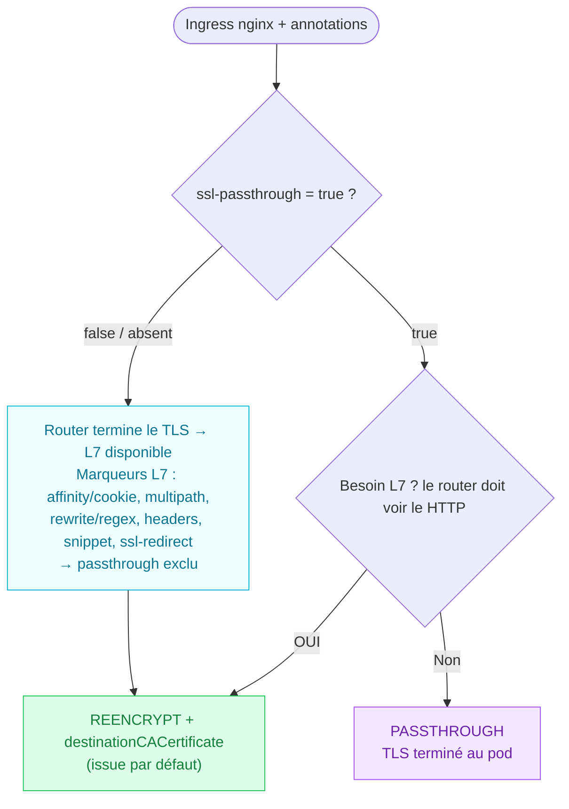

# Migration Ingress nginx (IKS) → Route OpenShift (ROKS)

> Référentiel de migration : arbre d'orientation de la terminaison TLS + tableau de correspondance des annotations `nginx.ingress.kubernetes.io/*` vers les Routes OpenShift.
> Pour chaque annotation sans équivalent natif sur la Route, une solution est proposée.
>
> Schémas associés (mêmes contenus, éditables) : `arbre-decision-tls-route.drawio`, `arbre-decision-tls-route.svg`.

---

## 1. Contexte & principes de la cible

- **Chiffrement pod-to-pod obligatoire** → le backend sert *toujours* du TLS.
  - `edge` est **exclu** par politique.
  - `reencrypt` est l'**issue par défaut** (avec `destinationCACertificate`).
  - `passthrough` est **réservé** aux cas où l'application n'a besoin d'aucun traitement L7 (le routeur ne voit que le SNI).
- **Pattern cible recommandé : `Route reencrypt → sidecar nginx`.**
  Toute la logique L7 que la Route ne sait pas porter (regex, CORS, snippets, buffering, tailles de body) **reste dans la conf du sidecar nginx**. La Route ne porte que ce qui est exprimable en annotation `haproxy.router.openshift.io/*` / `router.openshift.io/*` ou en champ `spec.*`.
- **Limites structurelles d'une Route** :
  - matching de path en **préfixe uniquement** (pas de regex) ;
  - **aucune injection** de configuration HAProxy arbitraire par Route (pas d'équivalent `configuration-snippet`) ;
  - en `passthrough`, le routeur ne voit que le SNI → ni cookie, ni multipath, ni manipulation HTTP.

---

## 2. Arbre d'orientation — passthrough ou reencrypt ? (version simplifiée)

`ssl-passthrough: true` n'est qu'une **intention déclarée**. Elle ne tient que si l'application n'a **aucun besoin L7**. Tout marqueur L7 (affinity/cookie, multipath, rewrite/regex, headers, snippet, ssl-redirect) bascule en **reencrypt**.



> **EDGE non applicable** : chiffrement pod-to-pod obligatoire (choix de politique, pas un oubli).

**Résumé décisionnel**

| Situation | Verdict |
|---|---|
| `ssl-passthrough = false` / absent | **REENCRYPT** |
| `ssl-passthrough = true` + besoin L7 (OUI) | **REENCRYPT** |
| `ssl-passthrough = true` + aucun besoin L7 (Non) | **PASSTHROUGH** |

---

## 3. Tableau de correspondance des annotations

Colonne **Cible** : `ANN` = annotation de Route · `SPEC` = champ `spec.*` de la Route · `IC` = configuration `IngressController` (global) · `SIDECAR` = à porter dans la conf du sidecar nginx · ❌ = pas d'équivalent natif Route.
Colonne **Équivalent Route** : `—` quand il n'existe pas d'équivalent (voir alors la colonne **Solution**).
Les lignes marquées *(doc)* sont confirmées par les tables 2 & 3 de la page Confluence existante.

### 3.1 TLS & redirection

| Annotation nginx | Cible | Équivalent Route | Solution |
|---|---|---|---|
| `nginx.ingress.kubernetes.io/ssl-passthrough` | SPEC | `spec.tls.termination: passthrough` | Uniquement si aucun besoin L7 (cf. arbre) ; sinon `reencrypt`. |
| `nginx.ingress.kubernetes.io/ssl-redirect` *(doc)* | SPEC | `spec.tls.insecureEdgeTerminationPolicy: Redirect` | Activé par défaut sur ROKS (HTTP non autorisé). |
| `nginx.ingress.kubernetes.io/force-ssl-redirect` | SPEC | `spec.tls.insecureEdgeTerminationPolicy: Redirect` | Idem `ssl-redirect`. |
| `ingress.kubernetes.io/force-ssl-redirect` | SPEC | `spec.tls.insecureEdgeTerminationPolicy: Redirect` | Ancienne clé, même mapping. |
| `nginx.ingress.kubernetes.io/backend-protocol` | SPEC | — | Déterminé par la terminaison (`reencrypt` ⇒ backend HTTPS). gRPC/h2c → `appProtocol` sur le Service ou `passthrough`. |
| `nginx.ingress.kubernetes.io/ssl-protocols` | IC / SIDECAR | — | Versions/ciphers via `IngressController.spec.tlsSecurityProfile` (global) ; par app → `ssl_protocols` du sidecar. |
| `nginx.ingress.kubernetes.io/proxy-ssl-verify` | SPEC | `spec.tls.destinationCACertificate` | Vérif du backend en reencrypt ; contrôle fin → sidecar. |
| `nginx.ingress.kubernetes.io/proxy-ssl-server-name` | SIDECAR | — | SNI vers backend non configurable per-route → `proxy_ssl_name` / `proxy_ssl_server_name` du sidecar. |
| `nginx.ingress.kubernetes.io/auth-tls-verify-client` | IC / SIDECAR | — | mTLS client via `IngressController.spec.clientTLS`, mTLS applicatif via `passthrough`, ou terminaison au sidecar. |
| `nginx.ingress.kubernetes.io/force-http1` | IC / SIDECAR | — | HTTP/2 piloté au niveau IngressController (`ingress.operator.openshift.io/default-enable-http2`) ; sinon downgrade au sidecar. |

### 3.2 Session affinity & cookies

| Annotation nginx | Cible | Équivalent Route | Solution |
|---|---|---|---|
| `nginx.ingress.kubernetes.io/affinity` *(doc)* | ANN | `haproxy.router.openshift.io/disable_cookies: "false"` | Sticky session activée par défaut. |
| `nginx.ingress.kubernetes.io/affinity-mode` | ANN | `haproxy.router.openshift.io/balance: source` | `persistent` ≈ cookie par défaut ; `source` = affinité par IP. |
| `nginx.ingress.kubernetes.io/session-cookie-name` *(doc)* | ANN | `router.openshift.io/cookie_name: <nom>` | — |
| `nginx.ingress.kubernetes.io/session-cookie-expires` | SIDECAR | — | Durée de vie du cookie non configurable sur Route → sticky avec `expires` au sidecar si requis. |
| `nginx.ingress.kubernetes.io/session-cookie-max-age` | SIDECAR | — | Idem → sidecar. |

> Annotations Route natives complémentaires côté cookie *(doc, Table 3)* : `haproxy.router.openshift.io/disable_cookies` (Boolean, désactive le sticky), `router.openshift.io/cookie-same-site` (attribut SameSite : Strict / Lax / None).

### 3.3 Routing, rewrite & path

| Annotation nginx | Cible | Équivalent Route | Solution |
|---|---|---|---|
| `nginx.ingress.kubernetes.io/rewrite-target` *(doc)* | ANN + SPEC | `haproxy.router.openshift.io/rewrite-target` + `spec.path` | — |
| `ingress.kubernetes.io/rewrite-target` | ANN + SPEC | `haproxy.router.openshift.io/rewrite-target` + `spec.path` | Ancienne clé, même mapping. |
| `nginx.ingress.kubernetes.io/use-regex` | SIDECAR | — | Route = matching préfixe (pas de regex, ex. `api/*` non géré) → `location` regex au sidecar. |
| `nginx.ingress.kubernetes.io/app-root` | SIDECAR | — | Pas d'équivalent → `rewrite` / `return 302` au sidecar ou géré par l'app. |
| `nginx.ingress.kubernetes.io/canary` *(doc)* | SPEC | `spec.alternateBackends` | Routage pondéré. |
| `nginx.ingress.kubernetes.io/canary-weight` *(doc)* | SPEC | `spec.alternateBackends` + `weight` | — |

### 3.4 Timeouts

| Annotation nginx | Cible | Équivalent Route | Solution |
|---|---|---|---|
| `nginx.ingress.kubernetes.io/proxy-read-timeout` | ANN | `haproxy.router.openshift.io/timeout` | Server timeout. |
| `nginx.ingress.kubernetes.io/proxy-send-timeout` | ANN | `haproxy.router.openshift.io/timeout` | Idem. |
| `nginx.ingress.kubernetes.io/proxy-connect-timeout` | IC / SIDECAR | — | `IngressController.spec.tuningOptions` (global) ou sidecar. |

### 3.5 Buffers, tailles de body & buffering

| Annotation nginx | Cible | Équivalent Route | Solution |
|---|---|---|---|
| `nginx.ingress.kubernetes.io/proxy-body-size` | SIDECAR | — | Le routeur HAProxy n'impose pas de limite de body. `0` = illimité (pas un blocage). Cap → `client_max_body_size` au sidecar. |
| `nginx.ingress.kubernetes.io/client-max-body-size` | SIDECAR | — | Idem → `client_max_body_size` au sidecar. |
| `nginx.ingress.kubernetes.io/client-body-buffer-size` | SIDECAR | — | Buffering au sidecar. |
| `nginx.ingress.kubernetes.io/client-header-buffer-size` | IC / SIDECAR | — | `IngressController.spec.tuningOptions.headerBufferBytes` (global) ou sidecar. |
| `nginx.ingress.kubernetes.io/large-client-header-buffers` | IC / SIDECAR | — | `tuningOptions.headerBufferMaxRewriteBytes` / `headerBufferBytes` ou sidecar. |
| `nginx.ingress.kubernetes.io/http2-max-header-size` | IC / SIDECAR | — | Tuning IngressController ou sidecar. |
| `nginx.ingress.kubernetes.io/proxy-buffer-size` | SIDECAR | — | `proxy_buffer_size` au sidecar. |
| `nginx.ingress.kubernetes.io/proxy-buffers` | SIDECAR | — | `proxy_buffers` au sidecar. |
| `nginx.ingress.kubernetes.io/proxy-buffers-number` | SIDECAR | — | `proxy_buffers` au sidecar. |
| `nginx.ingress.kubernetes.io/proxy-max-temp-file-size` | SIDECAR | — | `proxy_max_temp_file_size` au sidecar. |
| `nginx.ingress.kubernetes.io/proxy-buffering` | SIDECAR | — | `proxy_buffering on/off` au sidecar. |
| `nginx.ingress.kubernetes.io/proxy-request-buffering` | SIDECAR | — | `proxy_request_buffering on/off` au sidecar. |

### 3.6 Headers

| Annotation nginx | Cible | Équivalent Route | Solution |
|---|---|---|---|
| `nginx.ingress.kubernetes.io/use-forwarded-headers` | ANN | `haproxy.router.openshift.io/set-forwarded-headers` | Valeurs : append / replace / never / if-none. |
| `nginx.ingress.kubernetes.io/proxy_hide_header` | SPEC / SIDECAR | `spec.httpHeaders.actions.response` (type `Delete`) | OCP ≥ 4.13 ; sinon suppression au sidecar. |

> Pose / modification de headers génériques *(OCP ≥ 4.13)* : `spec.httpHeaders.actions` (Set / Delete, requête & réponse).

### 3.7 CORS

| Annotation nginx | Cible | Équivalent Route | Solution |
|---|---|---|---|
| `nginx.ingress.kubernetes.io/enable-cors` | SIDECAR | — | Pas de CORS natif Route → gestion au sidecar (headers `Access-Control-*` + réponse aux `OPTIONS`) ou app/gateway. |
| `nginx.ingress.kubernetes.io/cors-allow-origin` | SIDECAR | — | → sidecar. |
| `nginx.ingress.kubernetes.io/cors-allow-headers` | SIDECAR | — | → sidecar. |
| `nginx.ingress.kubernetes.io/cors-allow-methods` | SIDECAR | — | → sidecar. |
| `nginx.ingress.kubernetes.io/cors-allow-credentials` | SIDECAR | — | → sidecar. |

### 3.8 Snippets & divers

| Annotation nginx | Cible | Équivalent Route | Solution |
|---|---|---|---|
| `nginx.ingress.kubernetes.io/configuration-snippet` | SIDECAR | — | Aucune injection HAProxy per-route → reprendre le snippet tel quel dans la conf nginx du sidecar. Marqueur fort que la Route seule ne suffit pas. |
| `nginx.ingress.kubernetes.io/server-snippet` | SIDECAR | — | → sidecar. |
| `nginx.ingress.kubernetes.io/enable-rewrite-log` | IC / SIDECAR | — | Logs d'accès IngressController ou sidecar. |

---

## 4. Synthèse — annotations sans équivalent Route

Trois destinations possibles quand la Route ne couvre pas :

1. **Sidecar nginx** (le plus fréquent, cohérent avec le pattern cible) : regex/path, CORS, snippets, buffering, tailles de body/headers, timeouts fins, SNI upstream, app-root, cookie expires/max-age.
2. **IngressController (global, à arbitrer avec la plateforme)** : versions/ciphers TLS (`tlsSecurityProfile`), buffers de headers (`tuningOptions`), HTTP/2, mTLS client (`clientTLS`), timeouts globaux.
3. **spec.* de la Route** : redirection HTTP→HTTPS, path, canary (`alternateBackends`), manipulation de headers (`httpHeaders.actions`, OCP ≥ 4.13), vérif backend (`destinationCACertificate`).

> Règle pratique : si une annotation tombe en catégorie *IngressController*, elle est **globale** (impacte tous les Routes du contrôleur) → préférer le **sidecar** pour tout ce qui est spécifique à une application.

---

## 5. Exemples de Route cible

### 5.1 Route reencrypt avec sticky session (cas standard)

```yaml
apiVersion: route.openshift.io/v1
kind: Route
metadata:
  name: ap26330-api-contract
  annotations:
    haproxy.router.openshift.io/disable_cookies: "false"   # sticky session ON
    router.openshift.io/cookie_name: "nts-cookie"
    router.openshift.io/cookie-same-site: "Strict"
    haproxy.router.openshift.io/rewrite-target: /
    haproxy.router.openshift.io/timeout: 30s
    haproxy.router.openshift.io/set-forwarded-headers: append
spec:
  host: api-contract.apps.<cluster>.roks
  path: /api/contract                 # matching PRÉFIXE (pas de regex)
  to:
    kind: Service
    name: api-contract
    weight: 100
  port:
    targetPort: 8443
  tls:
    termination: reencrypt
    destinationCACertificate: |-
      -----BEGIN CERTIFICATE-----
      <CA du sidecar>
      -----END CERTIFICATE-----
    insecureEdgeTerminationPolicy: Redirect   # ssl-redirect / force-ssl-redirect
```

### 5.2 Canary / trafic pondéré (`canary` + `canary-weight`)

```yaml
spec:
  to:
    kind: Service
    name: api-v1
    weight: 90
  alternateBackends:
    - kind: Service
      name: api-v2
      weight: 10
```

### 5.3 Suppression de header (`proxy_hide_header`, OCP ≥ 4.13)

```yaml
spec:
  httpHeaders:
    actions:
      response:
        - name: Server
          action:
            type: Delete
```

### 5.4 Passthrough (uniquement si aucun besoin L7)

```yaml
spec:
  tls:
    termination: passthrough        # aucun L7 : ni cookie, ni path, ni rewrite
  port:
    targetPort: 8443
```

---

## 6. Points de vigilance migration

- **`proxy-body-size: 0`** n'est pas un bug : `0` = illimité côté nginx. Pas de régression sur Route (pas de limite par défaut). Cap éventuel → sidecar (sécurité anti-DoS).
- **`ssl-passthrough=true` + annotation L7** (affinity, rewrite, multipath, snippet…) : incohérence → la Route doit basculer en **reencrypt** (branche « OUI » de l'arbre).
- **Regex de path** (`use-regex`, patterns `api/*`) : non portables sur Route → sidecar.
- **Config globale vs par app** : préférer le sidecar aux réglages IngressController pour ne pas impacter les autres équipages.

---

## 7. Références

- Table 2 — *Correlation between IKS Ingress annotations and Route ROKS configurations* (page Confluence interne).
- Table 3 — *ROKS Route-specific annotations* (page Confluence interne).
- Documentation OpenShift : *Route configuration* / *Route-specific annotations* (`haproxy.router.openshift.io/*`, `router.openshift.io/*`), *IngressController tuningOptions*, *HTTP header actions* (`spec.httpHeaders.actions`).
